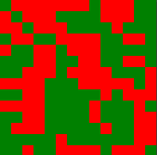
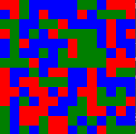
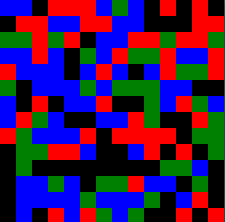

# Simulated Annealing Example
This is an example to show what simulated annealing can do with grouping colours together.
The gifs below show how the algorithm converges.

## Group pixels of 2 different colours together

## Group pixels of 3 different colours together

## Group pixels of 4 different colours together

Simulated annealing is used in the placement stage for creating ASICs. It tries to minimize a cost function, wire length in this case, by swapping or moving gates around to find a near optimal solution. This method isn't guarenteed to find the optimal placement but should be quite reasonable.